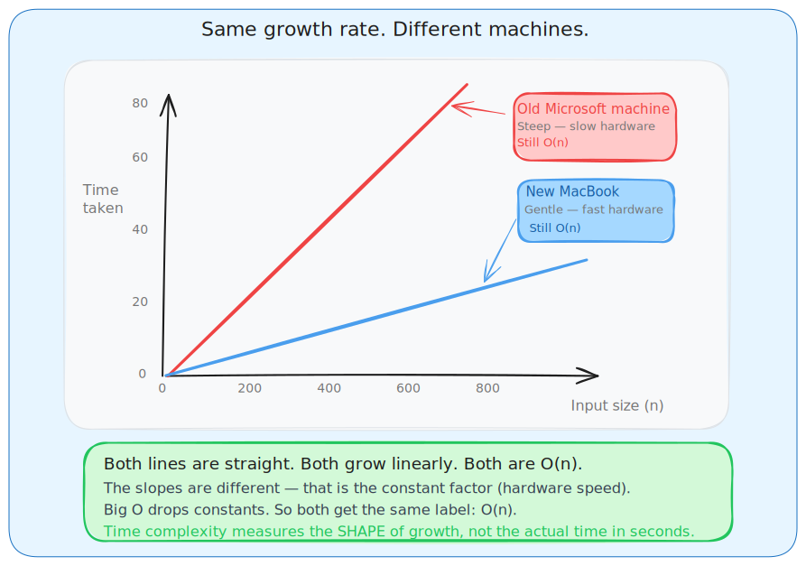

# **Time Complexity**

## **1. What Is Time Complexity**

Time complexity is the **rate at which the running time of your code grows with respect to input size**.

It does NOT measure actual time in seconds. It measures the **pattern of growth** — what happens to the number of steps when n becomes very large.

This matters because different machines run code at different speeds. An old Microsoft machine and a new MacBook will take different amounts of time for the same code. But both follow the same growth pattern. That pattern is what time complexity captures.

**The machine independence example:**

Linear search on array of 1000 elements:
- Old Microsoft machine: steep line going up fast
- New MacBook: gentle line going up slowly



Both are straight lines. Both grow linearly. Both are O(n). The actual time differs but the **shape of growth is identical**.

**Real life analogy — phone book:**

Searching for a name in a phone book with 1 million entries:
- Check every entry one by one — time doubles when book doubles. Linear growth.
- Open the middle, discard the half that cannot contain the name, repeat — even if book has 1 billion entries, you only need about 30 steps. Logarithmic growth.

Time complexity tells you which method is smarter when inputs get massive.

**The car analogy:**

Think of two cars traveling:
- Car A (old Microsoft machine): takes 4 hours for 100 km
- Car B (new MacBook): takes 2 hours for 100 km

Now double the distance to 200 km:
- Car A takes 8 hours (doubled)
- Car B takes 4 hours (doubled)

Both grew linearly. Both are O(n). The actual speed differs but the growth pattern is identical. This is exactly why time complexity is machine independent.

## **2. Why You Need to Know This Before Coding**

Without time complexity: you write code, run it, get TLE (Time Limit Exceeded), and have no idea why.

With time complexity: you look at the constraints, calculate complexity, and know if your solution will pass before writing a single line.

**Practical example:**

LeetCode says: array size up to 10⁵ (100,000 elements).

You think of a nested loop solution — O(n²).

Math check before coding:
```
(10⁵)² = 10¹⁰ operations
1 second ≈ 10⁸ operations
10¹⁰ / 10⁸ = 100 seconds
```

That is a guaranteed TLE. You need O(n log n) or O(n) instead. This calculation takes 10 seconds and saves you 30 minutes of debugging.


## **3. Three Golden Rules**

These three rules apply every single time you calculate time complexity. No exceptions.

### **Rule 1: Always use the worst case**

You only care about Big O (worst case) for interviews and problem solving. Best case is irrelevant because test cases will always hit your worst scenario.

**Linear search example:**
```
Best case  — target at index 0 → 1 step   (ignore this)
Worst case — target at last index or not found → n steps   (use this)
```

### **Rule 2: Drop all constants**

Constants are multipliers that do not change the shape of growth. Drop them.

```
O(3n)        →  O(n)
O(5n + 10)   →  O(n)
O(3n² + 7)   →  O(n²)
O(100)       →  O(1)
```

### **Rule 3: Keep only the dominant term (think at infinity)**

When n is 1 million, smaller terms become completely irrelevant. Only the fastest-growing term survives.

**let N = 1 million:**

For f(N) = N³ + log(N):
```
N³   = 1,000,000,000,000,000,000   (10¹⁸)
logN ≈ 20

The log term is 20 compared to 10¹⁸. It contributes nothing. Drop it.
Result: O(N³)
```

For f(N) = 6N³ + 4N² + 5N + 6:
```
6N³  = 6,000,000,000,000,000,000
4N²  = 4,000,000,000,000           (1 million times smaller)
5N   = 5,000,000                   (600 billion times smaller)
6    = 6                           (basically zero)

Drop everything except the dominant term.
Result: O(N³)
```

## **3. How to Read Code and Find Complexity**

This is the real skill. You need to look at code and instantly know its complexity.

### Single loop

```python
for i in range(n):
    print(i)
```

Runs n times. Each iteration is O(1). Total: **O(n)**

### Two loops back to back (not nested)

```python
for i in range(n):
    print(i)

for j in range(n):
    print(j)
```

First loop: n steps. Second loop: n steps. They run one after another, so you add them: n + n = 2n. Drop the constant. Total: **O(n)**

This is NOT O(n²). This is one of the most common mistakes. Nested means inside each other. Back to back means after each other.

### Nested loop — same variable

```python
for i in range(n):
    for j in range(n):
        print(i, j)
```

Outer loop runs n times. For every single outer iteration, the inner loop runs n times. They are inside each other, so you multiply: n × n. Total: **O(n²)**

Visual proof for n = 4:
```
i=0: j=0,1,2,3  →  4 operations
i=1: j=0,1,2,3  →  4 operations
i=2: j=0,1,2,3  →  4 operations
i=3: j=0,1,2,3  →  4 operations
Total: 16 = 4²
```

### Nested loop — dependent inner loop

```python
for i in range(n):
    for j in range(i, n):
        print(i, j)
```

```
i=0: inner runs n times
i=1: inner runs n-1 times
i=2: inner runs n-2 times
...
i=n-1: inner runs 1 time

Total = n + (n-1) + (n-2) + ... + 1 = n(n+1)/2
```

Drop constants and lower terms: **O(n²)**

### Halving each step — logarithmic

```python
i = n
while i > 1:
    print(i)
    i = i // 2
```

```
n=16:  16 → 8 → 4 → 2 → 1    (4 steps)
n=32:  32 → 16 → 8 → 4 → 2 → 1    (5 steps)
n=64:  64 → 32 → 16 → 8 → 4 → 2 → 1    (6 steps)
```

Every time n doubles, you only get 1 extra step. Steps = log₂(n). Total: **O(log n)**

### Outer loop + halving inner loop

```python
for i in range(n):
    j = n
    while j > 1:
        j = j // 2
```

Outer loop: n times. Inner loop: log n times each. Nested so multiply: **O(n log n)**

### Different arrays — different variables

```python
for i in range(len(A)):
    for j in range(len(B)):
        print(A[i], B[j])
```

A has 'a' elements. B has 'b' elements. They are different inputs. Total: **O(a × b)**

This is NOT O(n²). They are different variables. You can only say O(n²) when both dimensions are the same n.

### Three nested loops

```python
for i in range(n):
    for j in range(n):
        for k in range(n):
            print(i, j, k)
```

n × n × n. Total: **O(n³)**

## **4. The Complexity Hierarchy**

From fastest to slowest (best to worst as n grows):

```
O(1) < O(log n) < O(n) < O(n log n) < O(n²) < O(n³) < O(2ⁿ) < O(n!)
```

Full order from your notes:

```
O(1) < O(log log n) < O(log n) < O(n) < O(n log n) < O(n²) < O(n³) < O(2ⁿ)
```

### O(1) — Constant

No matter how big the input, always takes the same number of steps.

```python
arr = [10, 20, 30, 40, 50]
print(arr[2])   # Always 1 step regardless of array size
```

Real life: Opening a specific page in a book. Whether the book has 100 pages or 100,000 pages, opening page 42 takes the same effort.

### O(log n) — Logarithmic

Input doubles, but you only get 1 extra step. Extremely efficient.

```python
def binary_search(arr, target):
    low, high = 0, len(arr) - 1
    while low <= high:
        mid = (low + high) // 2
        if arr[mid] == target:
            return mid
        elif arr[mid] < target:
            low = mid + 1
        else:
            high = mid - 1
    return -1
```

Each iteration eliminates half the remaining array.

```
n = 1,000       →  ~10 steps
n = 1,000,000   →  ~20 steps
n = 1,000,000,000  →  ~30 steps
```

Real life: Finding a word in a dictionary. You open the middle, decide which half it is in, repeat. 1000 pages needs about 10 steps. 1 million pages needs about 20 steps.

### O(n) — Linear

Steps grow directly with input.

```python
def find_max(arr):
    max_val = arr[0]
    for x in arr:
        if x > max_val:
            max_val = x
    return max_val
```

Real life: Finding the tallest person in a line by walking past everyone once.

### O(n log n) — Log Linear

The sweet spot for sorting. Slightly above linear but much better than quadratic.

This is merge sort, heap sort, and the average case of quicksort.

Why: You divide the array log n times. Each division level costs O(n) work to merge. Total: n × log n.

### O(n²) — Quadratic

A loop inside a loop. Gets slow very fast.

```python
def bubble_sort(arr):
    n = len(arr)
    for i in range(n):
        for j in range(n - i - 1):
            if arr[j] > arr[j+1]:
                arr[j], arr[j+1] = arr[j+1], arr[j]
```

Real life: Every student in a class of 30 shaking hands with every other student. 30 × 30 = 900 handshakes.

```
n = 10    →  100 steps
n = 100   →  10,000 steps
n = 1000  →  1,000,000 steps
n = 10000 →  100,000,000 steps   (starting to be a problem)
```

### O(2ⁿ) — Exponential

Every new element doubles the work. Only usable for tiny inputs.

```python
def fib(n):
    if n <= 1:
        return n
    return fib(n-1) + fib(n-2)   # Two recursive calls every time
```

Each call creates 2 more calls. The call tree has 2ⁿ nodes.

Real life: A chain letter where you forward to 2 people, each forwards to 2 more. After 30 steps: 1 billion letters.

### O(n!) — Factorial

The worst possible growth. Only valid for n up to about 10.

Generating all permutations of n elements gives n! results. For n=12 that is already 479 million. For n=20 it is 2.4 quintillion.

**Real numbers at n = 20 — this makes the hierarchy very concrete:**

| Complexity | Operations | Time at 10⁸ ops/sec |
|---|---|---|
| O(1) | 1 | instant |
| O(log n) | ~5 | instant |
| O(n) | 20 | instant |
| O(n log n) | ~86 | instant |
| O(n²) | 400 | instant |
| O(n³) | 8,000 | instant |
| O(2ⁿ) | 1,048,576 | 0.01 sec |
| O(n!) | 2,432,902,008,176,640,000 | 770 years |

At n=20, factorial is already 770 years. This is not an exaggeration. This is why you never use brute force recursion without memoization.

## **5. The Five Notations**

### **Big O — O(n) — Worst case, upper bound**

"My algorithm will never be slower than this."

Used for 95% of all complexity analysis. When someone says "time complexity" they almost always mean Big O.

```
lim(n→∞)  f(n)/g(n)  =  finite value  (not infinity)

If this limit is finite, then f(n) = O(g(n))
```

Means: f grows no faster than g.

**Proof example from your notes — is 6N³ + 3N + 5 = O(N³)?**

```
f(N) = 6N³ + 3N + 5
g(N) = N³

lim(N→∞)  (6N³ + 3N + 5) / N³
= lim(N→∞)  [6 + 3/N² + 5/N³]
= 6 + 0 + 0
= 6

6 is finite, so yes: f(N) = O(N³)
The algorithm does not exceed this growth limit.
```

### Big Omega — Omega(n) — Best case, lower bound

"My algorithm will never be faster than this."

```
lim(n→∞)  f(n)/g(n)  >  0
```

Means: f grows at least as fast as g.

Linear search best case: element is at index 0, found immediately. **Omega(1)**

### Theta — Theta(n) — Tight bound, average case

"The algorithm is exactly this tight. Best and worst are the same order."

```
0  <  lim(n→∞)  f(n)/g(n)  <  infinity
```

The limit is neither 0 nor infinity — it is sandwiched in between. This means the functions grow at exactly the same rate.

Example: Finding max in an array. You always check every element no matter what. Best case is O(n) and worst case is O(n). Both are the same. So the tight bound is Theta(n).

### Little o — o(n) — Strict upper bound

Like Big O but stricter. f is strictly slower than g, never equal.

```
lim(n→∞)  f(n)/g(n)  =  0
```

```
Big O:      f ≤ g   (can be equal)
Little o:   f < g   (strictly less, never equal)
```

**Proof: Is n² = o(n³)?**
```
lim(n→∞)  n²/n³  =  lim(n→∞)  1/n  =  0   ✓

Yes, n² grows strictly slower than n³.
```

**Is n³ = o(n³)?**
```
lim(n→∞)  n³/n³  =  lim(n→∞)  1  =  1  ≠  0

No, n³ is NOT little-o of n³. Equal growth is not strictly less.
```

### Little omega — omega(n) — Strict lower bound

Opposite of little o. f grows strictly faster than g, never equal.

```
lim(n→∞)  f(n)/g(n)  =  infinity
```

```
Big Omega:    f ≥ g   (can be equal)
Little omega: f > g   (strictly greater, never equal)
```

**Proof: Is n³ = omega(n²)?**
```
lim(n→∞)  n³/n²  =  lim(n→∞)  n  =  infinity   ✓

Yes, n³ grows strictly faster than n².
```

### All five notations in one table

| Notation | Name | Bound | Case | Limit condition | Inequality |
|---|---|---|---|---|---|
| O(n) | Big O | Upper (loose) | Worst | lim f/g < infinity | f ≤ g |
| Omega(n) | Big Omega | Lower (loose) | Best | lim f/g > 0 | f ≥ g |
| Theta(n) | Theta | Tight | Average | 0 < lim f/g < infinity | f = g rate |
| o(n) | Little o | Upper (strict) | — | lim f/g = 0 | f < g |
| omega(n) | Little omega | Lower (strict) | — | lim f/g = infinity | f > g |

---

## 6. Mathematical Validation Using Limits

This is how you formally prove that one function belongs to a complexity class.

**The test:**
```
To prove f(n) = O(g(n)):
Compute lim(n→∞)  f(n)/g(n)
If the result is a finite number → proved
```

**Step by step example — your notes page 4:**

Prove: 6N³ + 3N + 5 = O(N³)

```
Step 1: Write the limit
lim(N→∞)  (6N³ + 3N + 5) / N³

Step 2: Divide every term by N³
= lim(N→∞)  [6N³/N³ + 3N/N³ + 5/N³]
= lim(N→∞)  [6 + 3/N² + 5/N³]

Step 3: Apply the limit (N→∞ makes fractions go to zero)
= 6 + 0 + 0
= 6

Step 4: Check — is 6 finite? Yes.
Conclusion: 6N³ + 3N + 5 = O(N³)
```

**Little o validation — is N² = o(N³)?**
```
lim(N→∞)  N²/N³
= lim(N→∞)  1/N
= 0

Limit equals 0, so yes: N² = o(N³) — strictly slower, not just slower-or-equal.
```

**Little omega validation — is N³ = omega(N²)?**
```
lim(N→∞)  N³/N²
= lim(N→∞)  N
= infinity

Limit equals infinity, so yes: N³ = omega(N²) — strictly faster.
```

---

## 7. Space Complexity

Same idea as time complexity but measuring **extra memory** instead of steps.

```python
# O(1) space — only one extra variable no matter how big input is
def sum_array(arr):
    total = 0
    for x in arr:
        total += x
    return total

# O(n) space — new list grows with input
def double_array(arr):
    result = []
    for x in arr:
        result.append(x * 2)
    return result

# O(n) space — call stack depth grows with n
def factorial(n):
    if n == 0:
        return 1
    return n * factorial(n - 1)   # n calls stacked in memory at once
```

---

## 8. Common Patterns in DSA Problems

Learn these patterns cold. In interviews you should identify the pattern immediately.

| Code pattern | Complexity | When to use |
|---|---|---|
| Single loop | O(n) | Linear search, find max, sum |
| Two loops back to back | O(n) | Two separate passes |
| Loop inside loop (same n) | O(n²) | Bubble sort, all pairs |
| Three nested loops | O(n³) | Triple combinations |
| Halving each step | O(log n) | Binary search |
| Loop + halving inner | O(n log n) | Merge sort |
| Two recursive calls | O(2ⁿ) | Naive fibonacci |
| Recursion + memoization | O(n) | DP fibonacci |
| Two pointers | O(n) | Sorted array pair search |
| Sliding window | O(n) | Subarray/substring problems |
| DFS / BFS on tree | O(n) | Visit all nodes |
| DFS / BFS on graph | O(V + E) | Visit all vertices and edges |
| Backtracking (subsets) | O(2ⁿ) | All subsets |
| Backtracking (permutations) | O(n!) | All arrangements |

### Recursion patterns in detail

**Simple recursion — one call per level:**

```python
def factorial(n):
    if n == 0:
        return 1
    return n * factorial(n - 1)

# factorial(5) calls factorial(4) calls factorial(3)... down to factorial(0)
# Number of calls: n
# Work per call: O(1)
# Total: O(n)
```

**Branching recursion — two calls per level:**

```python
def fibonacci(n):
    if n <= 1:
        return n
    return fibonacci(n-1) + fibonacci(n-2)

# Each call creates 2 more calls
# Call tree:
#              fib(5)
#            /        \
#        fib(4)       fib(3)
#        /    \       /    \
#    fib(3) fib(2) fib(2) fib(1)
#    ...
#
# Total nodes in tree ≈ 2ⁿ
# Total: O(2ⁿ)
```

Same fibonacci with memoization:

```python
def fibonacci(n, memo={}):
    if n <= 1:
        return n
    if n in memo:
        return memo[n]
    memo[n] = fibonacci(n-1, memo) + fibonacci(n-2, memo)
    return memo[n]

# Each value computed exactly once
# n unique values to compute
# Total: O(n)
```

This is why memoization is powerful. Same logic, same structure, but O(2ⁿ) becomes O(n).

### Real DSA examples with complexity

**Two Sum using hash map:**

```python
def two_sum(nums, target):
    hashmap = {}
    for i, num in enumerate(nums):
        complement = target - num
        if complement in hashmap:
            return [hashmap[complement], i]
        hashmap[num] = i

# Single pass through array: O(n)
# Hash map lookup is O(1) average
# Time: O(n)   Space: O(n)
```

**Binary Search:**

```python
def binary_search(arr, target):
    left, right = 0, len(arr) - 1
    while left <= right:
        mid = (left + right) // 2
        if arr[mid] == target:
            return mid
        elif arr[mid] < target:
            left = mid + 1
        else:
            right = mid - 1
    return -1

# Halves search space every iteration
# Time: O(log n)   Space: O(1)
```

**Merge Sort:**

```python
def merge_sort(arr):
    if len(arr) <= 1:
        return arr
    mid = len(arr) // 2
    left = merge_sort(arr[:mid])
    right = merge_sort(arr[mid:])
    return merge(left, right)

def merge(left, right):
    result = []
    i = j = 0
    while i < len(left) and j < len(right):
        if left[i] <= right[j]:
            result.append(left[i])
            i += 1
        else:
            result.append(right[j])
            j += 1
    result.extend(left[i:])
    result.extend(right[j:])
    return result

# Divide step: log n levels deep
# Merge step: O(n) work at each level
# Total: O(n log n)   Space: O(n)
```

**Bubble Sort:**

```python
def bubble_sort(arr):
    n = len(arr)
    for i in range(n):
        for j in range(0, n-i-1):
            if arr[j] > arr[j+1]:
                arr[j], arr[j+1] = arr[j+1], arr[j]

# Outer loop: n times
# Inner loop: roughly n times each
# Total: O(n²)   Space: O(1)
```

---

## 9. LeetCode Constraint Guide

Constraints in a problem tell you what complexity you need before you even start coding.

| Max n | Complexity you need | Notes |
|---|---|---|
| n <= 10 | O(n!) or O(2ⁿ) | Brute force is fine |
| n <= 20 | O(2ⁿ) | Recursion, bitmask |
| n <= 100 | O(n³) or O(n⁴) | Triple loops okay |
| n <= 500 | O(n³) | Floyd-Warshall, 3D DP |
| n <= 2000 | O(n²) | Nested loops okay |
| n <= 10⁴ | O(n²) tight | Start worrying |
| n <= 10⁵ | O(n log n) or O(n) | Sort + linear |
| n <= 10⁶ | O(n) | Single pass only |
| n <= 10⁹ | O(log n) or O(sqrt n) | Binary search, math |

**Quick sanity check math:**

Assume 1 second = 10⁸ operations.

```
n = 10⁵, your solution is O(n²):
(10⁵)² = 10¹⁰ operations
10¹⁰ / 10⁸ = 100 seconds   → TLE, guaranteed fail

n = 10⁵, your solution is O(n log n):
10⁵ × 17 ≈ 1.7 × 10⁶ operations
1.7 × 10⁶ / 10⁸ = 0.017 seconds   → passes comfortably

n = 10⁶, your solution is O(n):
10⁶ / 10⁸ = 0.01 seconds   → passes, but watch for large constants
```

### Hidden TLE traps — things that look fast but are not

These are the ones that silently kill your solution:

**String concatenation in a loop** — looks O(n), actually O(n²):
```python
# Wrong way — O(n²) because each += creates a new string copying all previous chars
result = ""
for i in range(n):
    result += str(i)

# Right way — O(n)
result = []
for i in range(n):
    result.append(str(i))
result = "".join(result)
```

**Sorting inside a loop** — O(n log n) inside O(n) = O(n² log n):
```python
for i in range(n):
    arr.sort()   # O(n log n) inside O(n) loop = O(n² log n). Do NOT do this.
```

**list.pop(0) in Python** — looks O(1), actually O(n) because it shifts all elements:
```python
from collections import deque
q = deque([1, 2, 3])
q.popleft()   # O(1) — use this instead of list.pop(0)
```

**Hash map worst case** — average O(1) but worst case O(n) due to hash collisions. Rare in practice but exists.

**Recursion depth** — if recursion goes deeper than ~10,000 levels in Python you get a stack overflow. Use iterative approach for deep recursion.

**I/O in tight loops** — reading/printing inside a loop can be slow. Read all input at once and process.

---

## 11. Optimization Strategies — How to Improve Complexity

When your brute force is too slow, here is how to think about making it faster:

**From O(n²) down to O(n):**
- Use a hash map to replace the inner loop lookup
- Two pointers technique on sorted arrays
- Sliding window for subarray/substring problems

**From O(n²) down to O(n log n):**
- Sort first, then use binary search instead of linear scan
- Use divide and conquer

**From O(2ⁿ) down to O(n):**
- Add memoization — store results of subproblems so you never recompute them
- This is the core idea behind dynamic programming

**From O(n log n) down to O(n):**
- Use counting sort or radix sort when values are in a small range
- Use hash map instead of a sorted tree structure

---

## 12. Practice Problems — Test Yourself

Go through these without looking at the answers first. Write the complexity, then check.

**Level 1 — Basic loops:**

```python
def problem1(n):
    result = 0
    for i in range(n):
        result += i
    return result
# Answer: O(n) — single loop
```

```python
def problem2(n):
    result = 0
    i = 1
    while i < n:
        result += i
        i *= 2
    return result
# Answer: O(log n) — i doubles each time, same as halving
```

```python
def problem3(n):
    for i in range(n):
        for j in range(i, n):
            print(i, j)
# Answer: O(n²) — dependent nested loops, sum = n(n+1)/2
```

**Level 2 — Mixed patterns:**

```python
def problem4(arr):
    n = len(arr)
    arr.sort()
    for i in range(n):
        left = i + 1
        right = n - 1
        while left < right:
            print(arr[i], arr[left], arr[right])
            left += 1
            right -= 1
# Answer: O(n²)
# Sort is O(n log n)
# Outer loop n times, inner while O(n) per iteration = O(n²)
# Total: O(n log n + n²) = O(n²)  — dominant term wins
```

```python
def problem5(n):
    count = 0
    for i in range(n):
        j = n
        while j > 1:
            count += 1
            j = j // 2
    return count
# Answer: O(n log n)
# Outer loop: n times
# Inner while: log n times (halving j each time)
# Nested → multiply: O(n × log n)
```

**Level 3 — Recursion:**

```python
def problem6(n):
    if n <= 1:
        return 1
    return problem6(n-1) + problem6(n-1)
# Answer: O(2ⁿ)
# Each call makes 2 recursive calls
# Tree has 2ⁿ nodes total
```

```python
def problem7(n, memo={}):
    if n <= 1:
        return 1
    if n in memo:
        return memo[n]
    memo[n] = problem7(n-1, memo) + problem7(n-2, memo)
    return memo[n]
# Answer: O(n)
# Memoization means each value computed exactly once
# n unique values, each O(1) work
```

---

## 13. Key Math Formulas

These come up frequently when calculating complexity of loops:

**Sum of arithmetic series:**
```
1 + 2 + 3 + ... + n = n(n+1)/2  →  O(n²)

This is why dependent nested loops (j starts from i) are still O(n²)
```

**Sum of geometric series (doubling):**
```
1 + 2 + 4 + 8 + ... + 2ⁿ = 2ⁿ⁺¹ - 1  →  O(2ⁿ)
```

**Logarithm definition:**
```
log₂(n) = number of times you can divide n by 2 before reaching 1

log₂(16) = 4   because 16 → 8 → 4 → 2 → 1
log₂(1024) = 10
log₂(1,000,000) ≈ 20
```

**Common limits you will use:**
```
lim(n→∞)  nᵃ / nᵇ  =  0   when a < b     (lower power loses)
lim(n→∞)  log(n) / n  =  0               (log grows slower than linear)
lim(n→∞)  n / 2ⁿ  =  0                   (exponential beats polynomial)
```

**Stirling's approximation:**
```
log(n!) ≈ n log n    (useful for knowing n! is worse than 2ⁿ)
```

---

## 14. Interview and Submission Checklist

Before you write code on a problem:

1. Read the constraints — what is the max n?
2. From the constraint table, decide what complexity you need
3. Think of your approach — what is its complexity?
4. Do the quick math: operations = f(n), time = operations / 10⁸
5. If it fits, code it. If not, think of a better approach first.

After you write code:

1. Check for hidden TLE traps (string concat, pop(0), sort inside loop)
2. Test edge cases: n=0, n=1, n=max value
3. Verify recursion depth will not cause stack overflow

In an interview:

1. State the time and space complexity before you start coding — it shows you think analytically
2. Explain the trade-offs — sometimes a worse time complexity has better space, or is simpler to implement
3. If your first solution is O(n²), say it out loud and mention you know a faster approach exists — this is better than pretending O(n²) is optimal
4. Analyze worst case explicitly, not just the happy path

**Mistake 1 — "Two loops means O(n²)"**

Only nested loops give O(n²). Back to back loops are O(n).

```python
for i in range(n):   # n steps
    pass
for j in range(n):   # n steps
    pass
# Total: O(n), not O(n²)
```

**Mistake 2 — "O(2n) and O(n) are different"**

Drop the constant. They are identical in Big O.

**Mistake 3 — "Different arrays use the same n"**

If arrays A and B have different sizes, use different variables. `for i in A: for j in B:` is O(a × b), not O(n²).

**Mistake 4 — "Best case matters for Big O"**

Big O is always worst case. Best case is Big Omega.

**Mistake 5 — "O(N³ + N²) simplifies to O(N²)"**

Wrong direction. You keep the HIGHEST term. O(N³ + N²) = O(N³).

**Mistake 6 — String concatenation in a loop**

```python
# Looks like O(n) but is actually O(n²)
result = ""
for i in range(n):
    result += str(i)   # creates a new string every iteration, copying all previous chars

# Fix: use a list and join at the end — O(n)
result = []
for i in range(n):
    result.append(str(i))
result = "".join(result)
```

---

## Quick Reference — For Revision Only

### Complexity order

```
O(1) < O(log n) < O(n) < O(n log n) < O(n²) < O(n³) < O(2ⁿ) < O(n!)
```

### Three golden rules

1. Always compute worst case
2. Drop constants — 3n becomes n
3. Drop lower terms — n³ + n² becomes n³

### Notation summary

| Notation | Bound | Limit | Used for |
|---|---|---|---|
| O(n) | Upper, loose | finite | Worst case — use this always |
| Omega(n) | Lower, loose | > 0 | Best case |
| Theta(n) | Tight | between 0 and inf | Average case |
| o(n) | Upper, strict | = 0 | Strictly slower |
| omega(n) | Lower, strict | = infinity | Strictly faster |

### Pattern to complexity

| Pattern | Complexity |
|---|---|
| Single loop | O(n) |
| Back to back loops | O(n) |
| Nested loops | O(n²) |
| Triple nested | O(n³) |
| Halving | O(log n) |
| Loop + halving inside | O(n log n) |
| Two recursive calls | O(2ⁿ) |

### Common algorithms

| Algorithm | Time | Space |
|---|---|---|
| Linear search | O(n) | O(1) |
| Binary search | O(log n) | O(1) |
| Bubble sort | O(n²) | O(1) |
| Merge sort | O(n log n) | O(n) |
| Quick sort (avg) | O(n log n) | O(log n) |
| Heap sort | O(n log n) | O(1) |
| DFS on tree | O(n) | O(h) — h is tree height |
| BFS on tree | O(n) | O(w) — w is max width |
| DFS on graph | O(V + E) | O(V) |
| BFS on graph | O(V + E) | O(V) |
| Dijkstra | O((V + E) log V) | O(V) |

### Red flags for TLE

- O(n²) when n > 10,000
- O(n³) when n > 500
- O(2ⁿ) when n > 25
- O(n!) when n > 10
- String concatenation inside a loop
- Sorting inside a loop
- list.pop(0) inside a loop — use deque.popleft() instead
- Recursion without memoization when subproblems overlap
- Deep recursion in Python (> 10,000 levels)

### Optimization cheatsheet

| Bottleneck | Fix |
|---|---|
| O(n²) inner loop lookup | Replace with hash map → O(n) |
| O(n²) sorted pair search | Two pointers → O(n) |
| O(n²) subarray scan | Sliding window → O(n) |
| O(2ⁿ) recursion | Add memoization → O(n) |
| O(n²) with sorted data | Binary search the inner → O(n log n) |

### Key math formulas for quick recall

```
1 + 2 + ... + n  =  n(n+1)/2  →  O(n²)   — dependent nested loops
1 + 2 + 4 + ... + 2ⁿ  =  2ⁿ⁺¹ - 1  →  O(2ⁿ)
log₂(n) = how many times you divide n by 2 to reach 1
log₂(10⁵) ≈ 17   log₂(10⁶) ≈ 20   log₂(10⁹) ≈ 30
```

---

*Phase 1, Week 1 — Time Complexity done. Next: Arrays and Matrix.*