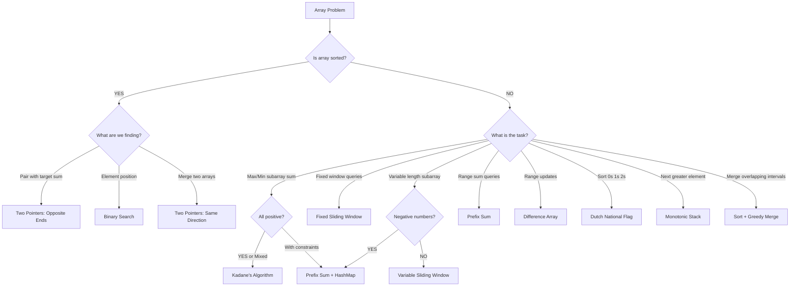

# **Arrays Complete Notes**
> **Language Agnostic | From Basics to Advanced | Think Like a Competitive Programmer**
> *Includes: Memory model, all core patterns with dry runs, advanced techniques, 6-step CP framework, categorised practice roadmap*

---

## Table of Contents
1. [What is an Array?](#1-what-is-an-array)
2. [Memory Model & Internals](#2-memory-model--internals)
3. [Types of Arrays](#3-types-of-arrays)
4. [Core Operations & Complexity](#4-core-operations--complexity)
5. [Important Concepts](#5-important-concepts)
   - Subarray vs Subsequence vs Subset
   - Prefix Sum
   - Difference Array
6. [Key Algorithms](#6-key-algorithms)
   - Kadane's Algorithm
   - Dutch National Flag
   - Array Rotation
7. [Problem-Solving Patterns](#7-problem-solving-patterns)
   - Two Pointers
   - Sliding Window (Fixed & Variable)
   - Prefix Sum + HashMap
8. [Advanced Techniques](#8-advanced-techniques)
   - HashMap for Array Problems
   - Greedy Approaches
   - DP on Arrays
   - Bit Manipulation
   - Handling Duplicates
9. [Dry Run Examples](#9-dry-run-examples)
10. [How to Think Like a Competitive Programmer](#10-how-to-think-like-a-competitive-programmer)
11. [Pattern Recognition Cheat Sheet](#11-pattern-recognition-cheat-sheet)
12. [Tips, Tricks & Common Traps](#12-tips-tricks--common-traps)
13. [Practice Roadmap](#13-practice-roadmap)

---

## 1. What is an Array?

An **array** is a linear data structure that stores elements at **contiguous memory locations**.

```
Index:   0    1    2    3    4
Value: [ 10 | 20 | 30 | 40 | 50 ]
        ↑
     Base Address (say 1000)
     Address of arr[i] = Base + i × (size_of_element)
```

### Why Arrays?
- **O(1) random access** — jump to any index instantly using the formula above
- **Cache friendly** — contiguous memory means CPU cache is utilized efficiently
- **Foundation** — Stacks, Queues, Heaps, Hash Tables are all built on arrays

### Key Vocabulary
| Term | Meaning |
|------|---------|
| Index | Position of element (0-based in most languages) |
| Element | Value stored at an index |
| Size / Length | Total number of elements |
| Bounds | Valid index range: `[0, n-1]` |

---

## 2. Memory Model & Internals

```
Memory Address:  1000   1004   1008   1012   1016
Array (int[]):  [ 10  |  20  |  30  |  40  |  50  ]
Index:             0      1      2      3      4

→ arr[i] lives at: BaseAddress + i × 4   (for 4-byte int)
```

### Static vs Dynamic Arrays

| Feature | Static Array | Dynamic Array (Vector/ArrayList) |
|---------|-------------|----------------------------------|
| Size | Fixed at compile time | Grows at runtime |
| Memory | Stack | Heap |
| Resize | Not possible | Possible (amortized O(1) append) |
| Examples | `int arr[10]` in C/C++ | `vector` (C++), `list` (Python), `ArrayList` (Java) |

### Dynamic Array Growth Strategy
When a dynamic array runs out of space, it:
1. Allocates a **2× larger** new array
2. Copies all elements over → O(n)
3. This happens rarely → **amortized O(1)** for append

### 2D Array Memory Layout (Row-Major Order)

Most languages store 2D arrays in **row-major order** — all elements of row 0 first, then row 1, etc.

```
2D Array:  matrix[3][3]          In Memory (row-major):
┌───┬───┬───┐
│ 1 │ 2 │ 3 │  Row 0    →  [ 1 | 2 | 3 | 4 | 5 | 6 | 7 | 8 | 9 ]
├───┼───┼───┤
│ 4 │ 5 │ 6 │  Row 1       Offset formula:
├───┼───┼───┤              index = i × num_columns + j
│ 7 │ 8 │ 9 │  Row 2
└───┴───┴───┘

matrix[1][2] → offset = 1×3 + 2 = 5 → value is 6 ✓
```

**2D Dry Run — Matrix Sum:**
```
matrix = [[1,2,3], [4,5,6], [7,8,9]]
sum = 0
for i = 0 to 2:
    for j = 0 to 2:
        sum += matrix[i][j]
→ sum = 45
```

---

## 3. Types of Arrays

### 3.1 One-Dimensional Array
```
arr = [5, 3, 8, 1, 9]
```

### 3.2 Two-Dimensional Array (Matrix)
```
matrix[3][3]:
  [ 1  2  3 ]
  [ 4  5  6 ]
  [ 7  8  9 ]

Access: matrix[row][col]
Row-major order in memory: 1,2,3,4,5,6,7,8,9
```

### 3.3 Jagged Array
An array of arrays where each row can have different length.
```
[ [1, 2],
  [3, 4, 5],
  [6] ]
```

### 3.4 Sparse Array
An array where most elements are 0 (or default). Store only non-zero values + their indices to save memory.

---

## 4. Core Operations & Complexity

| Operation | Time Complexity | Notes |
|-----------|----------------|-------|
| Access by index | **O(1)** | Direct formula |
| Search (unsorted) | **O(n)** | Linear scan |
| Search (sorted) | **O(log n)** | Binary search |
| Insert at end | **O(1)** amortized | Dynamic array |
| Insert at beginning/middle | **O(n)** | Shift elements right |
| Delete at end | **O(1)** | |
| Delete at beginning/middle | **O(n)** | Shift elements left |
| Traverse | **O(n)** | Visit all elements |

### Insertion Algorithm (at index k)
```
To insert X at position k in array of size n:
  for i = n-1 down to k:
      arr[i+1] = arr[i]    // shift right
  arr[k] = X
  n = n + 1
```

### Deletion Algorithm (at index k)
```
To delete element at position k in array of size n:
  for i = k to n-2:
      arr[i] = arr[i+1]    // shift left
  n = n - 1
```

---

## 5. Important Concepts

### 5.1 Subarray vs Subsequence vs Subset

```
Array: [1, 2, 3, 4]

Subarray   → Contiguous slice:          [2,3], [1,2,3], [3,4]
Subsequence → Maintain relative order:  [1,3], [2,4], [1,2,4]
Subset      → Any combination:          {1,3}, {2,4}, {1,2,3,4}
```

> **Critical rule**: Subarray = contiguous. Most sliding window and two-pointer problems are about subarrays.

### 5.2 Prefix Sum

**Idea**: Precompute cumulative sums so any range sum query becomes O(1).

```
Array:       [3,  1,  4,  1,  5,  9,  2]
Index:        0   1   2   3   4   5   6

Prefix[0] = 0
Prefix[1] = 3
Prefix[2] = 4
Prefix[3] = 8
Prefix[4] = 9
Prefix[5] = 14
Prefix[6] = 23
Prefix[7] = 25

Sum of arr[l..r] = Prefix[r+1] - Prefix[l]

Example: Sum of arr[2..4] = Prefix[5] - Prefix[2] = 14 - 4 = 10
Check: 4 + 1 + 5 = 10 ✓
```

**Build prefix sum:**
```
prefix[0] = 0
for i from 0 to n-1:
    prefix[i+1] = prefix[i] + arr[i]
```

**When to use Prefix Sum:**
- Multiple range sum queries
- Find subarray with given sum (especially with negative numbers)
- Count subarrays with certain property
- 2D matrix range sum queries

### 5.3 Difference Array

**Idea**: Efficiently apply range updates (add value to a range) in O(1), then reconstruct in O(n).

```
Array: [0, 0, 0, 0, 0, 0]  (n=6)

Operation: Add 3 to range [1, 4]
Difference array:  diff[1] += 3,  diff[5] -= 3
diff = [0, 3, 0, 0, 0, -3]

Reconstruct: prefix sum of diff
result = [0, 3, 3, 3, 3, 0]  ✓
```

**Use case**: Range update, point query problems (e.g. "stamp problems", "painting walls")

---

## 6. Key Algorithms

### 6.1 Kadane's Algorithm — Maximum Subarray Sum

**Problem**: Find the contiguous subarray with the maximum sum.

**Key Insight**: At each index, decide:
- Start fresh (take only current element)
- Extend previous subarray (previous_max + current element)

If previous running sum is negative → it only drags us down → reset to 0 (start fresh).

```
Algorithm:
  max_so_far    = arr[0]   // global max
  max_ending_here = arr[0] // local max ending here

  for i from 1 to n-1:
      max_ending_here = max(arr[i], max_ending_here + arr[i])
      max_so_far = max(max_so_far, max_ending_here)

  return max_so_far
```

#### Dry Run: arr = [-2, 1, -3, 4, -1, 2, 1, -5, 4]

| i | arr[i] | max_ending_here | max_so_far |
|---|--------|-----------------|------------|
| 0 | -2     | -2              | -2         |
| 1 |  1     | max(1, -2+1)=1  | 1          |
| 2 | -3     | max(-3, 1-3)=-2 | 1          |
| 3 |  4     | max(4, -2+4)=4  | 4          |
| 4 | -1     | max(-1, 4-1)=3  | 4          |
| 5 |  2     | max(2, 3+2)=5   | 5          |
| 6 |  1     | max(1, 5+1)=6   | **6**      |
| 7 | -5     | max(-5, 6-5)=1  | 6          |
| 8 |  4     | max(4, 1+4)=5   | 6          |

**Answer: 6** (subarray [4, -1, 2, 1])

**Complexity**: O(n) time, O(1) space

> **Variants to know:**
> - Minimum subarray sum (flip the max to min logic)
> - Maximum subarray sum in circular array (total_sum - min_subarray_sum)
> - Maximum product subarray (track both max and min due to negatives)

---

### 6.2 Dutch National Flag Algorithm

**Problem**: Sort an array containing only 3 distinct values (0, 1, 2) in a single pass.

**Key Insight**: Use 3 pointers: `low`, `mid`, `high`
- `[0, low)` → all 0s
- `[low, mid)` → all 1s
- `(high, n-1]` → all 2s
- `[mid, high]` → unsorted region

```
Algorithm:
  low = 0, mid = 0, high = n - 1

  while mid <= high:
      if arr[mid] == 0:
          swap(arr[low], arr[mid])
          low++, mid++
      elif arr[mid] == 1:
          mid++
      else:  // arr[mid] == 2
          swap(arr[mid], arr[high])
          high--
          // DON'T increment mid — recheck after swap
```

#### Dry Run: arr = [0, 2, 1, 0, 1]

```
Initial: low=0, mid=0, high=4
[0, 2, 1, 0, 1]

Step 1: arr[mid=0]=0 → swap(0,0), low=1, mid=1
[0, 2, 1, 0, 1]

Step 2: arr[mid=1]=2 → swap(arr[1],arr[4]), high=3
[0, 1, 1, 0, 2]

Step 3: arr[mid=1]=1 → mid=2
[0, 1, 1, 0, 2]

Step 4: arr[mid=2]=1 → mid=3
[0, 1, 1, 0, 2]

Step 5: arr[mid=3]=0 → swap(arr[1],arr[3]), low=2, mid=4
[0, 0, 1, 1, 2]

mid(4) > high(3) → STOP
Result: [0, 0, 1, 1, 2] ✓
```

**Complexity**: O(n) time, O(1) space

---

### 6.3 Array Rotation

#### Left Rotation by k

**Method 1 — Reversal (Most Important)**
```
To left rotate by k:
  1. Reverse arr[0..k-1]
  2. Reverse arr[k..n-1]
  3. Reverse entire arr[0..n-1]

Example: [1,2,3,4,5], k=2
Step 1: Reverse [1,2] → [2,1,3,4,5]
Step 2: Reverse [3,4,5] → [2,1,5,4,3]
Step 3: Reverse all → [3,4,5,1,2] ✓
```

**Method 2 — Temp Array**
```
Copy arr[k..n-1] then arr[0..k-1] into new array.
O(n) time, O(n) space.
```

**Complexity** (Reversal method): O(n) time, O(1) space

---

## 7. Problem-Solving Patterns

> **Golden Rule**: Before coding, identify the pattern. This saves 80% of your time.

---

### 7.1 Two Pointers

**When to use**:
- Sorted array
- Finding pairs with a target sum
- Removing duplicates in-place
- Palindrome check
- Merging sorted arrays

**Variants**:

#### Variant A: Opposite Ends (Sorted Array)
```
left = 0, right = n - 1

while left < right:
    current_sum = arr[left] + arr[right]
    if current_sum == target:
        FOUND
    elif current_sum < target:
        left++
    else:
        right--
```

#### Variant B: Same Direction (Fast & Slow)
```
slow = 0
for fast from 0 to n-1:
    if condition(arr[fast]):
        arr[slow] = arr[fast]
        slow++
// Elements [0..slow-1] satisfy condition
```
> **Use case**: Remove duplicates, move zeros to end, filter elements in-place

#### Dry Run: Two Sum in Sorted Array = [1, 3, 5, 7, 9], target = 10
```
left=0(1), right=4(9)  → 1+9=10 ✓ FOUND
```
#### Dry Run: Remove zeros — arr = [0, 1, 0, 3, 12]
```
slow=0
fast=0: arr[0]=0 → skip
fast=1: arr[1]=1 → arr[slow=0]=1, slow=1
fast=2: arr[2]=0 → skip
fast=3: arr[3]=3 → arr[slow=1]=3, slow=2
fast=4: arr[4]=12 → arr[slow=2]=12, slow=3

After: [1, 3, 12, 3, 12] → first slow=3 elements are answer: [1, 3, 12]
```

---

### 7.2 Sliding Window

**When to use**:
- Problems about **contiguous subarray/substring**
- Find maximum/minimum of a subarray of fixed or variable size
- Count subarrays satisfying a condition

#### Fixed Window (Size = k)
```
Compute sum of first k elements.
Then slide: add new right element, remove old left element.

sum = sum of arr[0..k-1]
max_sum = sum

for i from k to n-1:
    sum = sum + arr[i] - arr[i-k]
    max_sum = max(max_sum, sum)
```

#### Dry Run: Max sum of subarray size 3, arr=[2,1,5,1,3,2]
```
Initial window [2,1,5]: sum=8
Slide → [1,5,1]: sum=8-2+1=7
Slide → [5,1,3]: sum=7-1+3=9  ← max
Slide → [1,3,2]: sum=9-5+2=6
Answer: 9
```

#### Variable Window (Expand/Shrink)
```
left = 0
for right from 0 to n-1:
    // Expand: include arr[right] in window
    update_window(arr[right])

    // Shrink: while window violates condition
    while window_is_invalid():
        remove_from_window(arr[left])
        left++

    // At this point window is valid
    update_answer(right - left + 1)
```

#### Dry Run: Longest subarray with sum ≤ 5, arr=[1,2,3,1,2]
```
left=0, sum=0
right=0: sum=1, valid → len=1
right=1: sum=3, valid → len=2
right=2: sum=6, INVALID
  shrink: sum=6-1=5, left=1 → valid → len=2
right=3: sum=6, INVALID
  shrink: sum=6-2=4, left=2 → valid → len=2
right=4: sum=6, INVALID
  shrink: sum=6-3=3, left=3 → valid → len=2
Answer: 2
```

**Sliding Window Decision Guide**:
```
Does window size stay fixed?
  YES → Fixed Sliding Window
  NO  → Variable Sliding Window
         → Are elements only positive?
               YES → Two Pointers / Greedy shrink
               NO  → Prefix Sum + HashMap
```

---

### 7.3 Prefix Sum + HashMap

**When to use**:
- Count subarrays with sum = k
- Elements can be negative (sliding window won't work)
- Need to "look back" at previous prefix sums

**Core Idea**: If `prefix[j] - prefix[i] = k`, then subarray `arr[i+1..j]` sums to `k`.
Rearranged: We're looking for `prefix[i] = prefix[j] - k` in our hashmap.

```
Algorithm (Count subarrays with sum = k):
  count = 0
  prefix_sum = 0
  hashmap = {0: 1}   // empty subarray has sum 0

  for each element x in arr:
      prefix_sum += x
      count += hashmap.get(prefix_sum - k, 0)
      hashmap[prefix_sum] = hashmap.get(prefix_sum, 0) + 1

  return count
```

#### Dry Run: arr=[1,-1,1], k=1
```
prefix_sum=0, hashmap={0:1}, count=0

x=1:  prefix_sum=1, look for (1-1)=0 → found 1 time → count=1
      hashmap={0:1, 1:1}

x=-1: prefix_sum=0, look for (0-1)=-1 → not found → count=1
      hashmap={0:2, 1:1}

x=1:  prefix_sum=1, look for (1-1)=0 → found 2 times → count=3
      hashmap={0:2, 1:2}

Answer: 3  (subarrays: [1], [1,-1,1], [1])
```

---

## 8. Advanced Techniques

These are not separate "patterns" — they are tools you combine with the core patterns above.

### 8.1 HashMap for Array Problems

A HashMap (dictionary) gives **O(1) average lookup** and is the key to solving problems where you need to "remember" something seen before.

**Core Use Cases:**
- Two Sum (unsorted) — store seen values and their indices
- Subarray sum = k — store prefix sums (covered in section 7.3)
- Frequency counting — `freq[x] = freq.get(x, 0) + 1`
- First/last occurrence

```
Two Sum (Unsorted), target = 9, arr = [2, 7, 4, 5]:
  i=0: arr[0]=2, need=9-2=7, not in map. map={2:0}
  i=1: arr[1]=7, need=9-7=2, FOUND at index 0 → answer (0, 1)
```

> **Key insight**: If the array is sorted, use two pointers. If unsorted, use a HashMap.

### 8.2 Greedy Approaches on Arrays

Use greedy when making the **locally optimal choice** at each step leads to the globally optimal answer.

**Classic examples:**
- **Stock buy/sell** — sum all positive consecutive differences
- **Jump Game** — track how far you can reach at each step
- **Interval scheduling** — sort by end time, always pick earliest-ending non-overlapping interval

**Template:**
```
Greedy template for "max profit / min cost" on arrays:
  result = 0
  for i from 1 to n-1:
      if arr[i] > arr[i-1]:          // positive difference
          result += arr[i] - arr[i-1]  // take it greedily
```

### 8.3 Dynamic Programming on Arrays

DP on arrays = **dp[i] depends on dp[i-1]** (or some earlier state).

Kadane's algorithm is literally 1D DP in disguise. Most DP problems on arrays follow this shape:

```
General 1D DP pattern:
  dp[0] = base_case
  for i from 1 to n-1:
      dp[i] = some_function(dp[i-1], arr[i])
  return max/min/count from dp[]
```

**Classic problems:**
- Maximum subarray sum (Kadane's) → `dp[i] = max(arr[i], dp[i-1] + arr[i])`
- House Robber → `dp[i] = max(dp[i-1], dp[i-2] + arr[i])`
- Longest Increasing Subsequence → `dp[i] = 1 + max(dp[j]) for j<i where arr[j]<arr[i]`

> **Rule of thumb**: If a problem asks for "maximum/minimum/count over all subarrays/subsequences", think DP.

### 8.4 Bit Manipulation with Arrays

| Trick | Use Case |
|-------|----------|
| `a XOR a = 0` | Find single number in array of pairs |
| `a XOR 0 = a` | Identity element for XOR |
| `i & 1` | Check if odd |
| Flip sign trick | Find duplicates when values in range `[1, n]` |

**XOR trick — Find the single non-duplicate:**
```
arr = [2, 3, 2, 4, 4]
result = 0
for each x: result ^= x
→ result = 3   (all duplicates cancel out)
```

**Index-as-sign trick — Find missing number in [1, n]:**
```
arr = [3, 1, 3, 4, 2]  (values in range 1..n, one duplicate)
for each value v:
    index = abs(v) - 1
    if arr[index] < 0: duplicate found!
    else: arr[index] *= -1   // mark visited
```

### 8.5 Handling Duplicates

When an array has duplicates and you're using two pointers or sorted arrays:

```
Skip duplicates pattern (after sorting):
  for i from 1 to n-1:
      if arr[i] == arr[i-1]:
          continue    // skip duplicate
      process(arr[i])
```

For **in-place duplicate removal** (slow-fast pointer):
```
slow = 0
for fast from 1 to n-1:
    if arr[fast] != arr[slow]:
        slow++
        arr[slow] = arr[fast]
return slow + 1   // new length
```

---

### Example 1: Merge Intervals

**Problem**: Given intervals [[1,3],[2,6],[8,10],[15,18]], merge overlapping ones.

```
Step 1: Sort by start time (already sorted here)

Step 2: result = [[1,3]]

Check [2,6]: 2 <= 3 (overlaps) → merge → result=[[1,6]]
Check [8,10]: 8 > 6 (no overlap) → add → result=[[1,6],[8,10]]
Check [15,18]: 15 > 10 → add → result=[[1,6],[8,10],[15,18]]

Answer: [[1,6],[8,10],[15,18]]
```

### Example 2: Next Greater Element (Monotonic Stack with Array)

**Problem**: For each element, find the next greater element to its right.

```
arr = [4, 5, 2, 25]
stack = []
result = [-1, -1, -1, -1]

i=0: arr[0]=4, stack empty, push 4(idx=0)
i=1: arr[1]=5 > arr[stack.top()=0]=4 → result[0]=5, pop
     stack empty, push 5(idx=1)
i=2: arr[2]=2 < arr[stack.top()=1]=5 → just push 2(idx=2)
i=3: arr[3]=25 > arr[stack.top()=2]=2 → result[2]=25, pop
     arr[3]=25 > arr[stack.top()=1]=5 → result[1]=25, pop
     stack empty, push 25(idx=3)

Remaining in stack: [25(idx=3)] → result[3] = -1

Result: [5, 25, 25, -1]
```

---

## 10. How to Think Like a Competitive Programmer

### The 6-Step Problem Framework (Use Every Single Time)

```
┌──────────────────────────────────────────────────────────────────┐
│  Step 1: UNDERSTAND COMPLETELY                                   │
│    → Read problem 3 times. Write 3 sample I/O by hand.          │
│    → Note constraints (n ≤ 10⁵? 10⁹?) — they reveal the algo.  │
│                                                                   │
│  Step 2: DEVELOP INTUITION & IDENTIFY PATTERN                   │
│    → Is it sorted? Subarray? Pairs? Count or optimize?          │
│    → Match to pattern (see cheat sheet below)                   │
│                                                                   │
│  Step 3: DESIGN ALGORITHM                                        │
│    → Write pseudocode first. Dry-run on small example.          │
│    → Think brute force → identify bottleneck → optimize.        │
│                                                                   │
│  Step 4: IMPLEMENT CAREFULLY                                     │
│    → Handle edge cases before the main loop.                    │
│    → Use clear variable names (left/right not i/j for 2ptr).   │
│                                                                   │
│  Step 5: ANALYZE COMPLEXITY                                      │
│    → Time and space must fit constraints (see table below).     │
│                                                                   │
│  Step 6: OPTIMIZE & TEST EDGE CASES                             │
│    → Empty array, n=1, all negatives, all same, max n.          │
│    → If WA: find smallest failing case, print intermediates.    │
│    → If TLE: look for inner loops to eliminate with precompute. │
└──────────────────────────────────────────────────────────────────┘
```

**Dry Run Template (use on every problem before coding):**
```
Problem: Maximum subarray sum
Array: [2, 1, -3, 4, -1, 2, 1, -5, 4]
Pattern: Kadane's

i=0: curr=2,  global=2
i=1: curr=3,  global=3
i=2: curr=0,  global=3
i=3: curr=4,  global=4
i=4: curr=3,  global=4
i=5: curr=5,  global=5
i=6: curr=6,  global=6  ← answer
...
```

**Debugging mindset:**
- Pattern recognition > memorisation — after 50 problems, patterns become instant
- When stuck: reduce to smallest failing case, print every intermediate value
- Re-solve problems after 3 days — retention requires repetition
- 1 new pattern + 3 practice problems daily is the ideal pace

### Constraints → Time Complexity Map

| Constraint (n) | Max allowed complexity | Algorithm to think of |
|----------------|----------------------|-----------------------|
| n ≤ 10         | O(n!) or O(2^n)      | Brute force, bitmask  |
| n ≤ 20         | O(2^n)               | Bitmask DP            |
| n ≤ 500        | O(n²)                | Nested loops OK       |
| n ≤ 5000       | O(n² log n)          | Two-pointer + sort    |
| n ≤ 10^6       | O(n log n)           | Sort, binary search   |
| n ≤ 10^7       | O(n)                 | Linear scan, prefix   |
| n ≤ 10^9       | O(log n) or O(1)     | Math, binary search   |

> **Key habit**: Look at the constraint BEFORE designing your solution. This immediately narrows down what's acceptable.

### The "Brute → Optimize" Mindset

```
BRUTE FORCE first — always.
Ask yourself:
  "Why is this slow? What work am I repeating?"

Common optimizations:
  Repeating sum calculations → Prefix Sum
  Checking all pairs → Two Pointers (if sorted)
  Checking all subarrays → Sliding Window
  Repeated recursive calls → Memoization / DP
  Searching repeatedly → Binary Search / Hashing
```

### Asking the Right Questions While Solving

```
① Is the array sorted? → Two Pointers / Binary Search
② Are there negative numbers? → Prefix Sum (not sliding window for sums)
③ Subarray or Subsequence? → Subarray = Contiguous = Sliding/Prefix
④ Find count / max / min of subarray? → Sliding Window or Kadane
⑤ Multiple range queries? → Prefix Sum
⑥ Range updates? → Difference Array
⑦ Partition into groups? → Dutch National Flag / Two Pointers
⑧ Next greater/smaller? → Monotonic Stack
⑨ Fixed window? → Fixed Sliding Window
⑩ Variable window with all +ve? → Two Pointer shrink
⑪ Variable window with -ve? → Prefix Sum + HashMap
```

---

## 10. Pattern Recognition Cheat Sheet



---

## 12. Tips, Tricks & Common Traps

### ✅ Tips & Tricks

**1. Traversing twice is still O(n)**
> If you need a forward pass and a backward pass, that's still linear. Use it freely.

**2. Use start/end indices instead of slicing**
> Slicing `arr[l:r]` creates a copy → O(n). Use `l` and `r` pointers instead.

**3. "At most K" trick for sliding window**
> Problems asking "exactly K" can be solved as:
> `count(exactly K) = count(at most K) - count(at most K-1)`

**4. Off-by-one boundary check habit**
> Always verify: does your loop use `<` or `<=`? Is the window `right - left + 1` or `right - left`?

**5. Prefix sum array of size n+1**
> Always make prefix array one larger than input → avoids index -1 edge case.
```
prefix[0] = 0
prefix[i+1] = prefix[i] + arr[i]
```

**6. Normalize negative indices in circular arrays**
> `index = ((i % n) + n) % n`  — works for both positive and negative i.

**7. Two pointer templates — memorize them**
> If sorted: opposite ends. If filtering/partitioning: slow-fast same direction.

**8. Sorting unlocks many patterns**
> Many unsorted array problems become easy after sorting. Sort first, then apply two pointers, binary search, or greedy.

**9. Think about the invariant**
> In two-pointer and sliding window, maintain a clear invariant:
> "At all times, window `[left, right]` satisfies property X"

**10. Frequency array as substitute for HashMap**
> If values are in range `[0, 10^5]`, use a plain array instead of hashmap — faster.

---

### Common Traps to Avoid

| Trap | What Goes Wrong | Fix |
|------|----------------|-----|
| Integer overflow | `int sum` for large arrays | Use `long` / `long long` |
| Off-by-one in binary search | Infinite loop or wrong answer | Use closed vs open interval carefully |
| Modifying array while iterating | Wrong results | Use two-pointer or copy |
| Initializing `max = 0` | Fails for all-negative arrays | Initialize to `arr[0]` or `-infinity` |
| Using slicing in tight loops | TLE (O(n²) hidden cost) | Use index pointers |
| Not handling empty array | Runtime crash | Always check `n == 0` |
| Prefix sum index mismatch | Wrong range queries | Dry run `prefix[r+1] - prefix[l]` once |
| Forgetting `hashmap[0] = 1` in prefix sum | Misses subarrays starting from index 0 | Always initialize |

---

## 13. Practice Roadmap

### Stage 1 — Foundation (Warm Up)
- [ ] Find max/min element
- [ ] Reverse an array
- [ ] Check if array is sorted
- [ ] Rotate array by k positions
- [ ] Find second largest element

### Stage 2 — Core Patterns
- [ ] Two Sum (sorted array) — Two Pointers
- [ ] Move zeros to end — Two Pointers (slow-fast)
- [ ] Maximum sum subarray — Kadane's
- [ ] Maximum sum of subarray of size k — Fixed Sliding Window
- [ ] Longest subarray with sum ≤ k — Variable Sliding Window
- [ ] Subarray sum equals k (with negatives) — Prefix Sum + HashMap
- [ ] Sort 0s, 1s, 2s — Dutch National Flag

### Stage 3 — Intermediate
- [ ] Merge intervals
- [ ] Next greater element (monotonic stack)
- [ ] Trapping rain water
- [ ] Product of array except self (prefix + suffix product)
- [ ] Maximum product subarray
- [ ] Minimum in rotated sorted array

### Stage 4 — Advanced
- [ ] Largest rectangle in histogram
- [ ] Sliding window maximum (deque)
- [ ] Count of subarrays with exactly k distinct elements
- [ ] Jump game (greedy on arrays)
- [ ] 2D matrix — spiral order, rotate, set zeroes

---

## Quick Reference Summary

```
ARRAY COMPLEXITY CHEAT SHEET
─────────────────────────────────
Access         O(1)
Search         O(n) unsorted | O(log n) sorted
Insert end     O(1) amortized
Insert middle  O(n)
Delete end     O(1)
Delete middle  O(n)
─────────────────────────────────
KEY ALGORITHMS
─────────────────────────────────
Kadane's           O(n)  time  O(1) space
Prefix Sum build   O(n)  time  O(n) space
Range query        O(1)  after prefix
Dutch National F   O(n)  time  O(1) space
Array Rotation     O(n)  time  O(1) space (reversal)
─────────────────────────────────
PATTERN TRIGGERS
─────────────────────────────────
Sorted + pairs         → Two Pointers
Contiguous subarray    → Sliding Window
Negative + sum query   → Prefix Sum + Hash
3-category sort        → Dutch National Flag
Max subarray sum       → Kadane's
Range updates          → Difference Array
Multiple range queries → Prefix Sum
Next greater element   → Monotonic Stack
─────────────────────────────────
```

---

> **Final Mantra**: *"Brute force first, identify bottleneck, eliminate repeated work."*
>
> Every pattern you learn is just a way to eliminate a redundant nested loop. Internalize that, and you'll derive patterns yourself.

---

*Notes compiled for competitive programming preparation — language agnostic.*